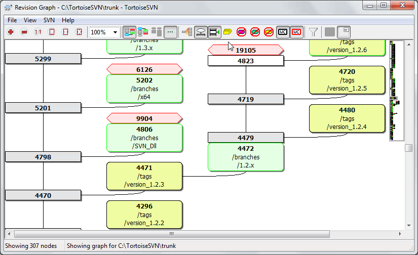
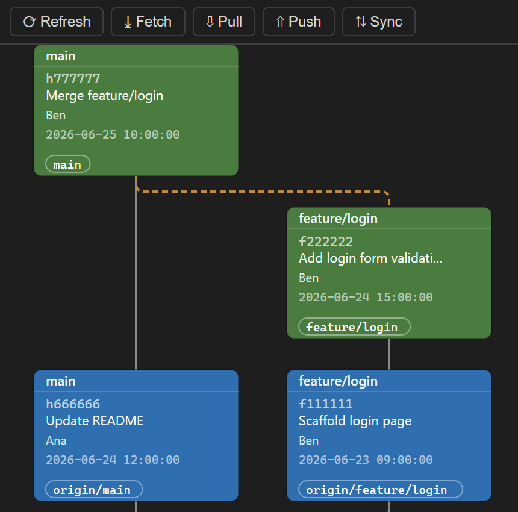

# Git Revision Graph

A **TortoiseSVN-style Revision Graph** for **Git**, shipped for **VS Code**,
**Visual Studio (2022 / 2026)**, the **JetBrains** IDE family, **Eclipse** and
**Apache NetBeans**. Commits, local & remote branches, tags, stashes and merges
are drawn as connected, color-coded boxes; from the graph you can branch, merge,
reword, undo, checkout, diff and commit — all through the host's native Git.

**▶ [Try the live demo](https://hunkontech.github.io/git_Revision_Graph/)** — runs the
real renderer in your browser with a sample repository; every action (branch,
merge, reword, checkout, diff, commit, stash, zoom & pan) works against mock data.





## Where to get it
- [VS Code Marketplace](https://marketplace.visualstudio.com/items?itemName=BenKoncsik.rev-graph-vscode)
- [Visual Studio Marketplace (2022 / 2026)](https://marketplace.visualstudio.com/items?itemName=BenKoncsik.GitRevisionGraph)
- [JetBrains Marketplace](https://plugins.jetbrains.com/plugin/32627-revision-graph-for-git-svn-style-) — IntelliJ IDEA, Android Studio, DevEco Studio, WebStorm, PyCharm, GoLand, etc.
- **Eclipse** — p2 update site published with each GitHub Release.
- **Apache NetBeans** — `.nbm` on each GitHub Release, plus a NetBeans Autoupdate Center.

## What it does
- Renders the git DAG as boxes-and-edges with a column-per-branch layout, in a
  modern (free canvas) or classic (trunk-pinned) display mode.
- Colors nodes by ref type: current/HEAD, local branch, remote branch,
  remote-only, tag, stash, plain commit, and commits merged into the branch that
  received them — echoing the SVN graph's grey/green/yellow scheme.
- **Branch** — create a branch from any commit via an SVN-style folder-tree
  dialog or the host's native branch UI; rename, delete or push a branch.
- **Merge** — merge or squash-merge one branch into another, with a schematic
  preview that shows the merge direction.
- **Rewrite history** — reword a commit message; undo a commit while keeping its
  changes.
- **Inspect** — a commit's changed files, file diffs with a minimap, and search
  inside a diff (`Ctrl/Cmd+F`).
- **Commit** — stage and commit working-tree changes from the graph, with an
  optional review step.
- **Stash** — apply, pop or drop a stash.
- **Remotes** — fetch, pull, push and sync from the toolbar; search commit
  messages; jump to HEAD; checkout, copy SHA, zoom & pan.
- **Localized** — English, Magyar, 中文, Русский; light/dark themes; optional
  plain-language labels instead of git jargon.

## How to open the graph

### VS Code
1. Open a folder or workspace that contains a Git repository.
2. Either:
   - Open the **Command Palette** (`Ctrl+Shift+P`) and run **"Git Revision Graph: Open Revision Graph"**, or
   - Click the **graph icon** in the Source Control title bar (top-right of the SCM panel).

### Visual Studio (2022 / 2026)
1. Open a folder or solution that is inside a Git repository.
2. Go to **View → Other Windows → Revision Graph**.

### JetBrains IDEs
1. Open a project under Git version control.
2. **Tools → Revision Graph** (or press **Shift** twice and type "Revision Graph").

### Eclipse
1. Open a workspace with a Git repository.
2. **Revision Graph** menu → **Revision Graph**, or **Window → Show View → Other → Git → Revision Graph**.

### Apache NetBeans
1. Open a project inside a Git repository.
2. **Tools → Revision Graph**.

Right-click any commit node to branch, merge, reword, undo, checkout, view its
changes, or copy its SHA.

## Architecture (monorepo)
One shared web renderer, embedded by several thin hosts:

```
packages/
  protocol/      host <-> webview message contracts (single source of truth)
  graph-core/    pure DAG lane/row layout algorithm (unit-tested, no DOM)
  graph-webview/ the SVG renderer + context menus + i18n (builds to one bundle)
vscode/          VS Code extension (TS): vscode.git data + git CLI
vs/              Visual Studio VSIX (C#): tool window + WebView2 host
jetbrains/       JetBrains plugin (Kotlin, IntelliJ Platform, JCEF host)
eclipse/         Eclipse plugin (Java, PDE/OSGi, SWT Browser host)
netbeans/        Apache NetBeans module (Kotlin, JavaFX WebView host; reuses the
                 JetBrains host's shared git/DTO Kotlin)
```

The `graph-webview` bundle is the shared artifact loaded by every host's
webview. Each host talks to its own **native** Git (the `vscode.git` API or a
git CLI wrapper) behind the same message protocol.

## Develop

```bash
npm install
npm test                 # graph-core layout unit tests
npm run build            # build all packages + both host bundles
npm run harness          # browser dev harness with mock data -> http://localhost:5599
```

### VS Code extension
```bash
npm run build
```
Then open the repo in VS Code and press **F5** (Extension Development Host).
Run **"Git Revision Graph: Open Revision Graph"** from the command palette, or
use the source-control title-bar button. Requires a workspace with a Git repo.

### Visual Studio extension
Windows-only (2022 / 2026). See [vs/BUILD.md](vs/BUILD.md) for complete prerequisites and build steps.

Quick start:
```bash
npm install
npm run build:webview
npm run build:vs-assets
```

Then open `vs/RevisionGraph.csproj` in Visual Studio (with the extension development workload installed), restore NuGet packages, and press **F5** to launch an experimental instance. Open a folder or solution inside a Git repo, then go to **View → Other Windows → Revision Graph** to open the tool window. Right-click a commit to create a branch from it using the native Git CLI.

## Building the installers

```bash
# VS Code .vsix only (cross-platform)
npm run package:vscode      # -> dist/installers/rev-graph-vscode-<version>.vsix
```

```powershell
# All three installers — Windows + Visual Studio + Node (run from repo root)
pwsh scripts/build-installers.ps1            # VS 2022 + VS 2026 VSIX + VS Code vsix
pwsh scripts/build-installers.ps1 -VSCodeOnly
pwsh scripts/build-installers.ps1 -SkipVSCode
```

- [scripts/package-vscode.mjs](scripts/package-vscode.mjs) — builds the shared
  bundle and packages the VS Code extension via `@vscode/vsce`.
- [scripts/build-installers.ps1](scripts/build-installers.ps1) — locates VS 2022
  (`[17.0,18.0)`) and VS 2026 (`[18.0,19.0)`, prerelease) with `vswhere`, builds
  the VSIX against each, and also packages the VS Code `.vsix`.

All outputs land in `dist/installers/`.

## Status
- ✅ `graph-core` layout + tests
- ✅ shared SVG renderer + context menu (verified in browser harness)
- ✅ VS Code extension (data layer verified against a real repo end-to-end)
- ✅ Visual Studio VSIX authored (build & run on Windows per `vs/BUILD.md`)
- ✅ JetBrains plugin authored (Kotlin, one build across the IntelliJ Platform family per `jetbrains/BUILD.md`)
- ✅ Eclipse plugin authored (Java, PDE/OSGi + Tycho p2 update site per `eclipse/BUILD.md`)
- ✅ Apache NetBeans plugin authored (Kotlin, reuses the JetBrains shared git/DTO code; build the `.nbm` per `netbeans/BUILD.md`)

## License

**[Business Source License 1.1](LICENSE)** — free for personal, internal, and non-commercial use. Selling, reselling, or offering the software as a paid product or service is not permitted. Converts to MPL 2.0 four years after each version's release.

---

# Git Revision Graph (Magyar)

Egy **TortoiseSVN-stílusú revíziógraf** **Git**-hez, amely elérhető **VS Code**,
**Visual Studio (2022 / 2026)**, a **JetBrains** IDE-család, **Eclipse** és
**Apache NetBeans** alá. A commitok, helyi és távoli ágak, tagek, stash-ek és
merge-ök összekötött, színkódolt dobozokként jelennek meg; a gráfból branch-elhetsz,
merge-elhetsz, átnevezhetsz, visszavonhatsz, checkout-olhatsz, diffelhetsz és
commitolhatsz — mindezt a fogadó alkalmazás natív Git-jén keresztül.

**▶ [Próbáld ki az élő demót](https://hunkontech.github.io/git_Revision_Graph/)** — a
valódi megjelenítő fut a böngésződben egy minta-repozitóriummal; minden funkció
(ág, merge, átnevezés, checkout, diff, commit, stash, nagyítás és mozgatás) működik a
mock adatokon.


## Hol érhető el
- [VS Code Marketplace](https://marketplace.visualstudio.com/items?itemName=BenKoncsik.rev-graph-vscode)
- [Visual Studio Marketplace (2022 / 2026)](https://marketplace.visualstudio.com/items?itemName=BenKoncsik.GitRevisionGraph)
- [JetBrains Marketplace](https://plugins.jetbrains.com/plugin/32627-revision-graph-for-git-svn-style-) — IntelliJ IDEA, Android Studio, DevEco Studio, WebStorm, PyCharm, GoLand, stb.
- **Eclipse** — p2 update site, minden GitHub Release-hez közzétéve.
- **Apache NetBeans** — `.nbm` minden GitHub Release-en, plusz NetBeans Autoupdate Center.

## Mit csinál
- A git DAG-ot dobozok és élek formájában rajzolja ki, áganként egy oszloppal, modern (szabad vászon) vagy klasszikus (balra rögzített törzs) nézetben.
- A csomópontokat ref-típus szerint színezi: aktuális/HEAD, helyi ág, távoli ág, csak-távoli, tag, stash, sima commit, és a fogadó ágba merge-ölt commitok — az SVN-gráf szürke/zöld/sárga sémájára emlékeztetve.
- **Ág** — új ág bármely committól SVN-stílusú mappafa-párbeszéddel vagy a fogadó alkalmazás natív ág-ablakával; ág átnevezése, törlése, push-olása.
- **Merge** — egy ág merge-ölése vagy squash-merge-ölése egy másikba, a merge irányát mutató sematikus előnézettel.
- **Történet átírása** — commit üzenet átírása; commit visszavonása a változtatások megtartásával.
- **Vizsgálat** — egy commit módosított fájljai, fájl-diffek minimappel, és keresés a diffen belül (`Ctrl/Cmd+F`).
- **Commit** — a munkakönyvtár változtatásainak stage-elése és commitolása a gráfból, opcionális átnézési lépéssel.
- **Stash** — stash alkalmazása, pop-olása vagy eldobása.
- **Távoli** — fetch, pull, push és sync az eszköztárból; commit üzenetek keresése; ugrás a HEAD-re; checkout, SHA másolása, nagyítás és mozgatás.
- **Honosított** — English, Magyar, 中文, Русский; világos/sötét téma; opcionálisan közérthető feliratok a git szakzsargon helyett.

## A gráf megnyitása

### VS Code
1. Nyiss meg egy mappát vagy munkaterületet, amely egy Git repozitóriumot tartalmaz.
2. Vagy:
   - Nyisd meg a **Parancspalettát** (`Ctrl+Shift+P`) és futtasd a **"Git Revision Graph: Open Revision Graph"** parancsot, vagy
   - Kattints a **gráf ikonra** a Forráskezelő panel fejlécében (jobb felső sarok).

### Visual Studio (2022 / 2026)
1. Nyiss meg egy mappát vagy megoldást, amely egy Git repozitóriumon belül van.
2. Lépj a **Nézet → Egyéb ablakok → Revision Graph** menüpontba.

### JetBrains IDE-k
1. Nyiss meg egy Git verziókövetés alatt álló projektet.
2. **Tools → Revision Graph** (vagy nyomd meg kétszer a **Shift**et és írd be: „Revision Graph").

### Eclipse
1. Nyiss meg egy Git repozitóriumot tartalmazó workspace-t.
2. **Revision Graph** menü → **Revision Graph**, vagy **Window → Show View → Other → Git → Revision Graph**.

### Apache NetBeans
1. Nyiss meg egy Git repozitóriumon belüli projektet.
2. **Tools → Revision Graph**.

Jobb klikkel bármely commit csomóponton branch-elhetsz, merge-elhetsz, átnevezhetsz, visszavonhatsz, checkout-olhatsz, megnézheted a változtatásait, vagy másolhatod a SHA-ját.

## Architektúra (monorepo)
Egy közös webes megjelenítő, amelyet több vékony hoszt foglal magában:

```
packages/
  protocol/      hoszt <-> webview üzenetszerződések (egyetlen forrás)
  graph-core/    tiszta DAG sáv/sor elrendező algoritmus (egységtesztelt, DOM nélkül)
  graph-webview/ az SVG megjelenítő + helyi menük + i18n (egy bundle-lé épül)
vscode/          VS Code bővítmény (TS): vscode.git adat + git CLI
vs/              Visual Studio VSIX (C#): eszközablak + WebView2 hoszt
jetbrains/       JetBrains plugin (Kotlin, IntelliJ Platform, JCEF hoszt)
eclipse/         Eclipse plugin (Java, PDE/OSGi, SWT Browser hoszt)
netbeans/        Apache NetBeans modul (Kotlin, JavaFX WebView hoszt; a JetBrains
                 hoszt közös git/DTO Kotlin kódját újrahasználja)
```

A `graph-webview` bundle a közös termék, amelyet minden hoszt webview-ja betölt. Minden hoszt a saját **natív** Git-jével beszél (a `vscode.git` API vagy egy git CLI wrapper) ugyanazon üzenet-protokoll mögött.

## Fejlesztés

```bash
npm install
npm test                 # graph-core elrendező egységtesztek
npm run build            # minden csomag + mindkét hoszt bundle buildelése
npm run harness          # böngészős fejlesztői harness mock adatokkal -> http://localhost:5599
```

### VS Code bővítmény
```bash
npm run build
```
Majd nyisd meg a repót VS Code-ban és nyomj **F5**-öt (Extension Development Host).
Futtasd a **"Git Revision Graph: Open Revision Graph"** parancsot a parancspalettáról, vagy használd a forráskezelő fejlécgombot. Git repót tartalmazó munkaterület szükséges.

### Visual Studio bővítmény
Csak Windows (2022 / 2026). Lásd [vs/BUILD.md](vs/BUILD.md) a teljes előfeltételekért és build lépésekért.

Gyors indítás:
```bash
npm install
npm run build:webview
npm run build:vs-assets
```

Majd nyisd meg a `vs/RevisionGraph.csproj`-t Visual Studioban (a bővítményfejlesztési munkaterhelés telepítve legyen), állítsd vissza a NuGet csomagokat, és nyomj **F5**-öt egy kísérleti példány indításához. Nyiss meg egy Git repón belüli mappát vagy megoldást, majd lépj a **Nézet → Egyéb ablakok → Revision Graph** menüpontba.

## Telepítők buildelése

```bash
# Csak VS Code .vsix (cross-platform)
npm run package:vscode      # -> dist/installers/rev-graph-vscode-<verzió>.vsix
```

```powershell
# Mindhárom telepítő — Windows + Visual Studio + Node (a repo gyökeréből futtatva)
pwsh scripts/build-installers.ps1            # VS 2022 + VS 2026 VSIX + VS Code vsix
pwsh scripts/build-installers.ps1 -VSCodeOnly
pwsh scripts/build-installers.ps1 -SkipVSCode
```

Minden kimenet a `dist/installers/` mappába kerül.

## Állapot
- ✅ `graph-core` elrendező + tesztek
- ✅ közös SVG megjelenítő + helyi menü (böngészős harness-ben ellenőrizve)
- ✅ VS Code bővítmény (adatréteg valós repón végigvizsgálva)
- ✅ Visual Studio VSIX elkészítve (build & futtatás Windows alatt a `vs/BUILD.md` szerint)
- ✅ JetBrains plugin elkészítve (Kotlin, egyetlen build az IntelliJ Platform családhoz a `jetbrains/BUILD.md` szerint)
- ✅ Eclipse plugin elkészítve (Java, PDE/OSGi + Tycho p2 update site a `eclipse/BUILD.md` szerint)
- ✅ Apache NetBeans plugin elkészítve (Kotlin, a JetBrains közös git/DTO kódot újrahasználja; `.nbm` a `netbeans/BUILD.md` szerint)

## Licenc

**[Business Source License 1.1](LICENSE)** — személyes, belső és nem-kereskedelmi célú használatra ingyenes. A szoftver eladása, továbbértékesítése, vagy fizetős termékként/szolgáltatásként történő kínálása nem megengedett. Verziónként a megjelenéstől számított négy év után MPL 2.0 licencre vált.
